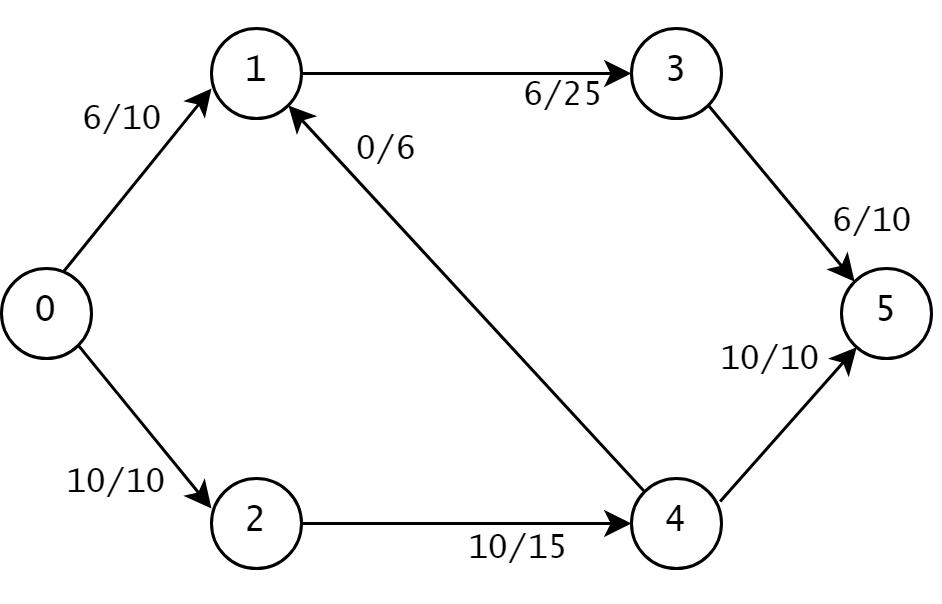
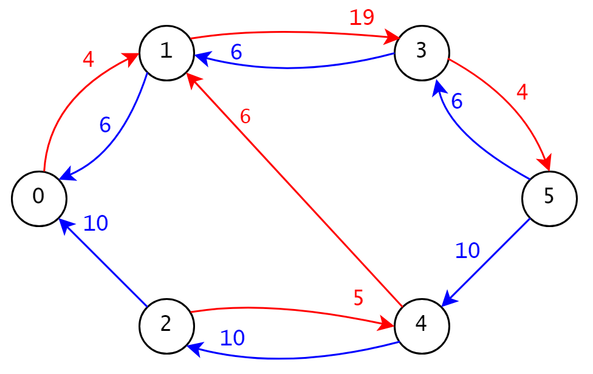
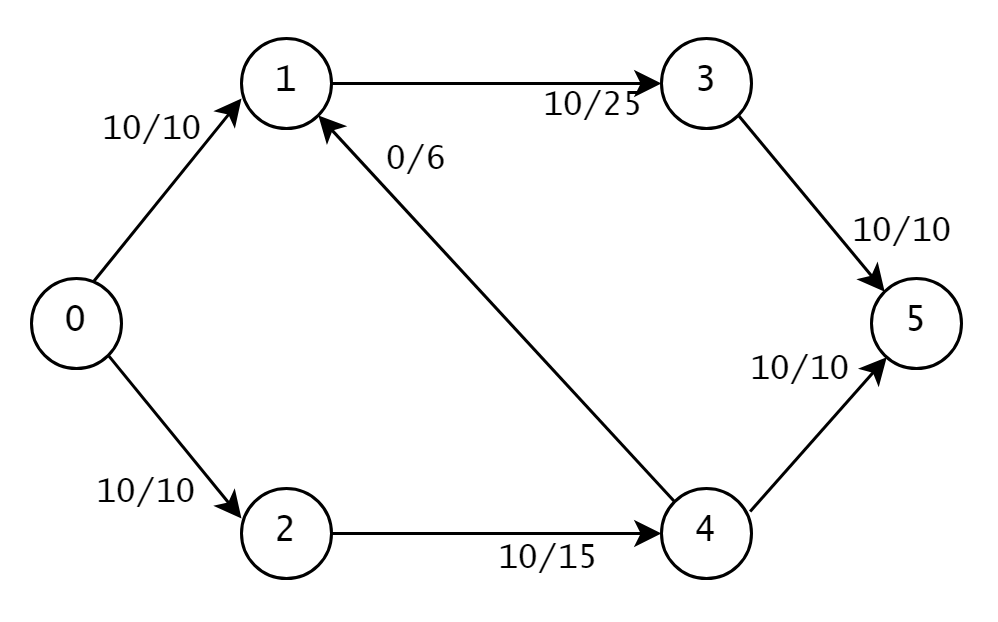

# simple-max-flow
A basic implementation of the [Ford-Fulkerson maximum-flow algorithm](https://en.wikipedia.org/wiki/Ford%E2%80%93Fulkerson_algorithm) (FFA).

## Motivation
This algorithm is the first solution to the [maximum flow problem](https://en.wikipedia.org/wiki/Maximum_flow_problem), and the idea is to model a problem with a flow network and find a flow that fits the constraints but is as large as possible. FFA does this by repeatedly creating a residual graph and finding an available path for augmenting flow. Learning how FFA works provides a foundational understanding of maximum flow problems, of which translate nicely into real world problems like airline scheduling and baseball elimination. 

## How to use
Add your flow network by inputing its edges, flows, and capacities in ``edges``. An edge follows the format ``[u,v,c(e),f(e)]...e = (u,v) edge, c(e) capacity, f(e) flow``. Nodes are numbers ``0,1,2,...`` and the source or start node is ``0``.

Run ``python src/main.py`` and see your output!

## Example
This example was based on this [video](https://www.youtube.com/watch?v=LdOnanfc5TM).

We have the following **flow network**:



Beside each edge is a label for its flow and capacity. For example, the edge from node ``0`` to node``1`` has the label ``6/10`` and so it has flow ``6`` and capacity ``10``.

Now let's get its **residual graph**:



Edges in red are called **_forward edges_** and they represent how much flow we can _push_, while edges in blue are called **_backward edges_** and they represent how much flow we can _take back_. If we recall the edge between nodes ``0`` and ``1`` from our original flow network above, we can push at most ``4`` units into it and take back at most ``6`` units, which is why in our residual graph there are two edges between ``0`` and ``1``, a red forward edge and blue backward edge.

Next we find a path from nodes ``0`` to ``5`` in the residual graph. There is one path: ``0``->``1``->``3``->``5``. The minimum capacity along this path called the **_bottleneck_** is ``min(4,19,4) = 4``. We follow this path in our original flow network and push ``4`` units along each edge. (If our path included a backward edge, then we would take away ``4`` units from the corresponding edge in the original flow network instead). Our resulting flow network after augmenting becomes



If we were to make a new residual graph, there would be no forward edges coming out of our source ``0`` and thus no way to get to our sink ``5``. We can also see that no more flow can be pushed out from ``0``. Either way, our maximum flow is ``20`` units. 

Our code would output:
```
Input flow network G:
node 0: [[1, 10, 6], [2, 10, 10]]
node 1: [[3, 25, 6]]
node 2: [[4, 15, 10], [5, 10, 0]]
node 3: [[5, 10, 6]]
node 4: [[2, 6, 0], [5, 10, 0]]
node 5: [[4, 10, 10]]
Flow network with max flow G_max:
node 0: [[1, 10, 10], [2, 10, 10]]
node 1: [[3, 25, 10]]
node 2: [[4, 15, 10], [5, 10, 0]]
node 3: [[5, 10, 10]]
node 4: [[2, 6, 0], [5, 10, 0]]
node 5: [[4, 10, 10]]
max-flow value of G = 20
```

